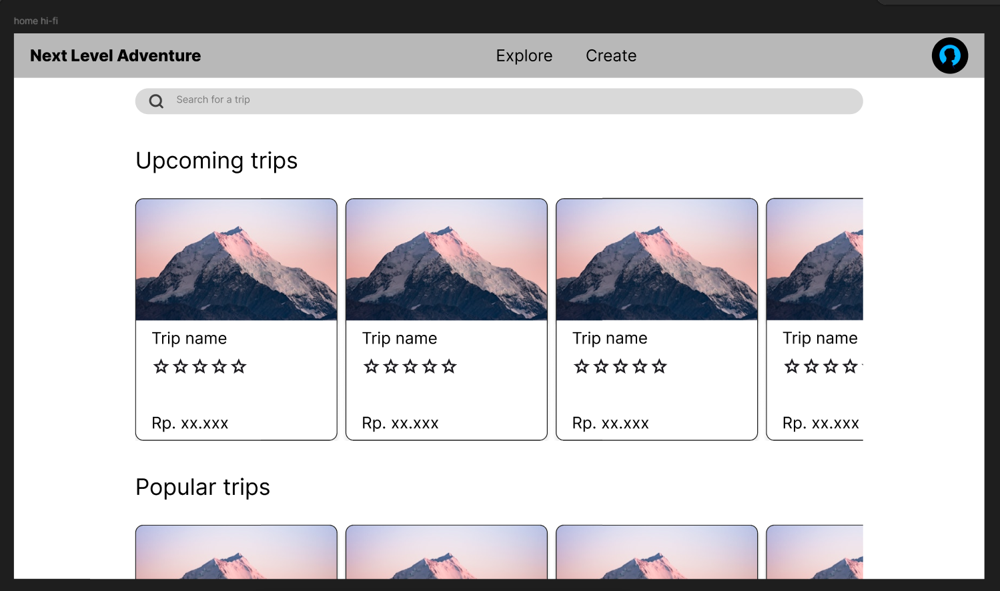
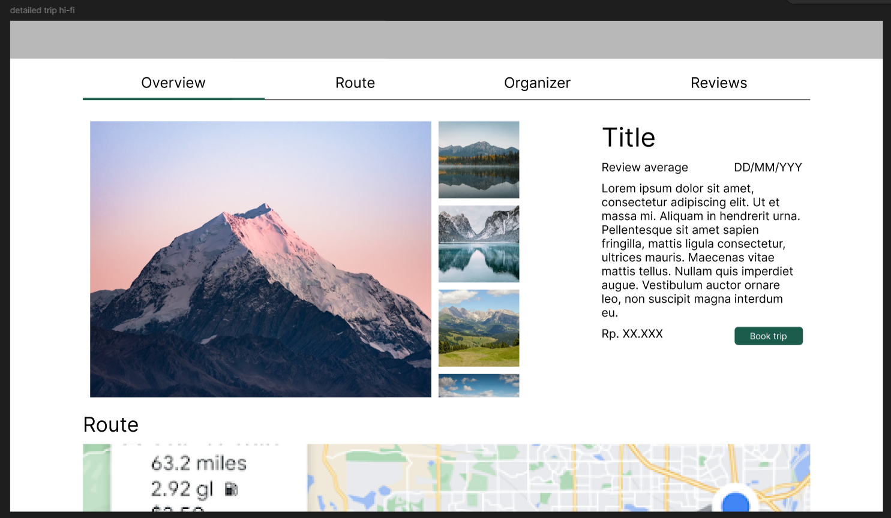
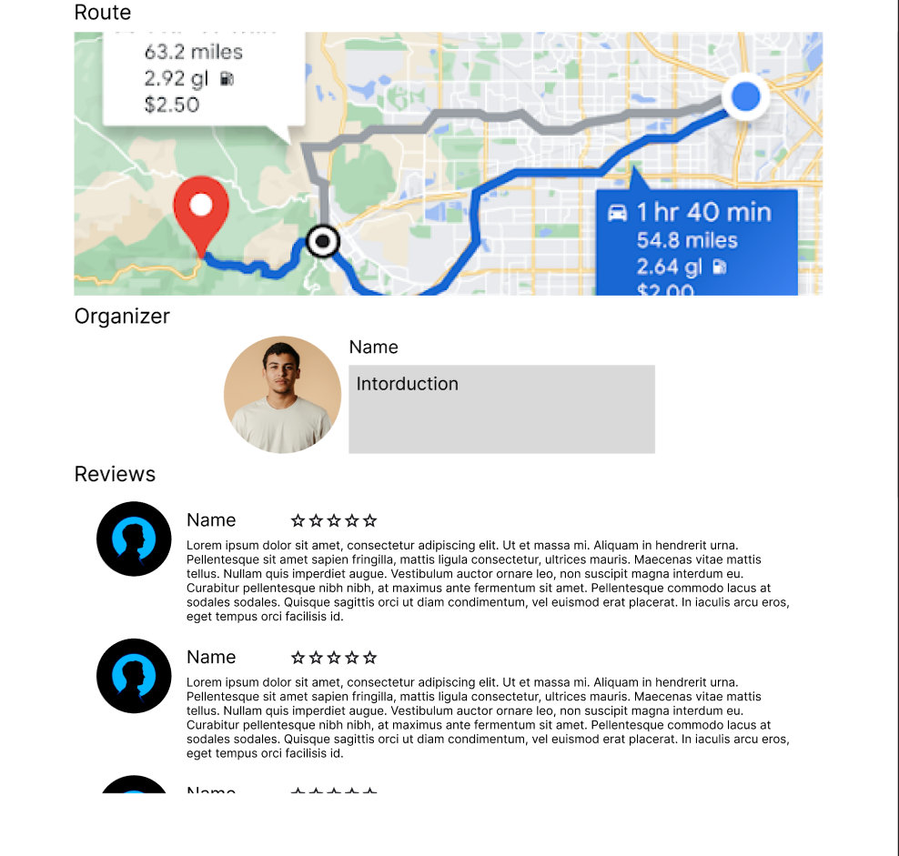
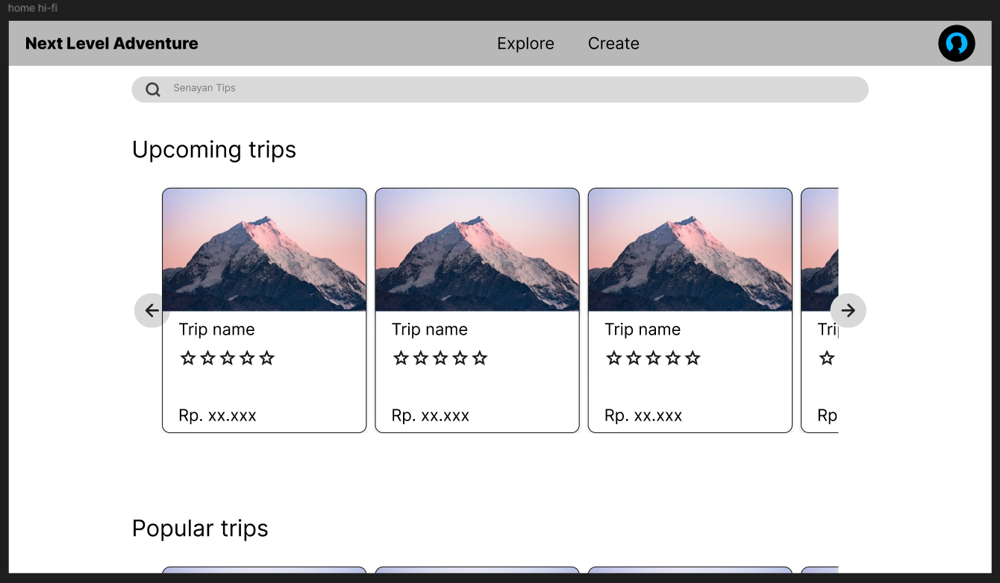

# Quiz2-HCI
Juan Carlos Calderón García - 2902729273

## Part A Design

### Original page
#### Home

#### Detailed trip

### Updated page
#### Trip creation

Added arrows to allow the rows of cards in the home page to be paginated, and changed the placeholder in the searchbar to be more similar to what you could search

## Part B Implementation

Navigation
The current version of the page has a navbar at the top from which you can access the rest of the features of the site, and the detailed trip page has extra navigation that sticks to the top of the browser to allow the user to easily access all the information of the trip at any moment

Input & forms
The search bar already had a placeholder, but it only indicated that the searchbar was a search bar, with the changes now th can help indicate what wording could be used when searching for trips

Feedback and status
The buttons on the page change to indicate they are being selected and can be clicked, informing the user which elements are interactible, which aren't

Laoyut and structure
The home page uses a grid of cards in order to show the necesary information in a way that is easy to read

Data presentation
The rows of cards used for the home screen were updated with arrows that allow for pagination, this way it's easier to navigate through the sugestions in the home page